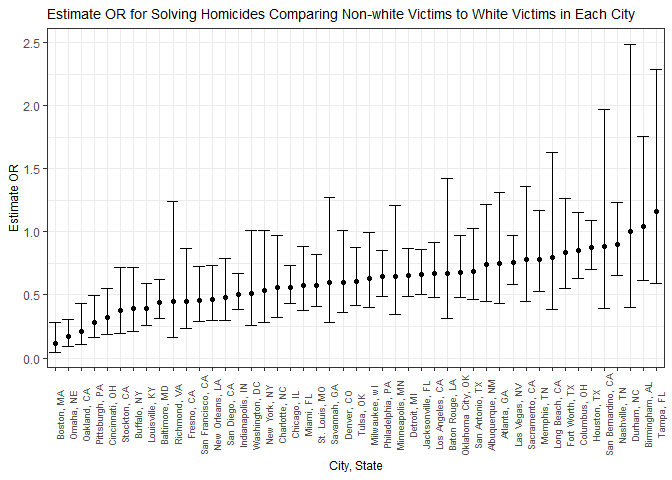

p8105\_hw6\_js5165
================
Jingqi Song
November 28, 2018

Problem 1
---------

### Read and tidy data

``` r
homicide = read_csv("./homicide-data.csv") %>% 
  janitor::clean_names() %>% 
  mutate(city_state = paste(paste0(city, ","), state),
         victim_race = fct_relevel(ifelse(victim_race == 'White', 'white', 'non-white'), 'white'),
         victim_age = as.numeric(victim_age),
         victim_sex = as.factor(victim_sex),
         resolved = as.numeric(disposition == 'Closed by arrest')) %>% 
  filter(!city_state %in% c('Dallas, TX', 'Phoenix, AZ', 'Kansas City, MO', 'Tulsa, AL')) 
```

    ## Parsed with column specification:
    ## cols(
    ##   uid = col_character(),
    ##   reported_date = col_integer(),
    ##   victim_last = col_character(),
    ##   victim_first = col_character(),
    ##   victim_race = col_character(),
    ##   victim_age = col_character(),
    ##   victim_sex = col_character(),
    ##   city = col_character(),
    ##   state = col_character(),
    ##   lat = col_double(),
    ##   lon = col_double(),
    ##   disposition = col_character()
    ## )

    ## Warning in evalq(as.numeric(victim_age), <environment>): NAs introduced by
    ## coercion

### Obtain the estimate and confidence interval for Baltimore

``` r
baltimore_glm = homicide %>% 
  select(uid, victim_race, victim_age, victim_sex, city_state, resolved) %>% 
  filter(city_state == 'Baltimore, MD') %>% 
  glm(resolved ~ victim_age + victim_sex + victim_race, data =., family = binomial()) 

save(baltimore_glm, file = 'Baltimore_logistic.RData')

baltimore_glm %>% broom::tidy() %>% 
  mutate(OR = exp(estimate),
         conf_low = exp(estimate - 1.96*std.error),
         conf_high = exp(estimate + 1.96*std.error)) %>% 
  filter(term == "victim_racenon-white") %>% 
  dplyr::select(term, estimate, OR, conf_low, conf_high, p.value) %>% 
  knitr::kable(digits = 2)
```

| term                  |  estimate|    OR|  conf\_low|  conf\_high|  p.value|
|:----------------------|---------:|-----:|----------:|-----------:|--------:|
| victim\_racenon-white |     -0.82|  0.44|       0.31|        0.62|        0|

### Obtain the estimate and confidence interval for each city

``` r
all_glm = function(x){
  homicide %>% 
  filter(city_state == x) %>% 
  glm(resolved ~ victim_age + victim_sex + victim_race, data =., family = binomial())  %>% 
  broom::tidy() %>% 
  mutate(OR = exp(estimate),
         conf_low = exp(estimate - 1.96*std.error),
         conf_high = exp(estimate + 1.96*std.error)) %>% 
    filter(term == "victim_racenon-white") %>% 
    dplyr::select(beta = estimate, OR, conf_low, conf_high, p.value)
  }

city_glm = tibble(city_state = unique(homicide$city_state)) %>% 
  mutate(map(.x = unique(homicide$city_state), ~all_glm(.x))) %>% 
  unnest
```

### Plot that shows the estimated ORs and CIs for each city

``` r
city_glm %>%
  mutate(city_state = fct_reorder(city_state, OR)) %>% 
  ggplot(aes(x = city_state, y = OR)) +
  geom_point() +
  geom_errorbar(mapping = aes(ymin = conf_low, ymax = conf_high)) + 
  labs(
    title = "Estimate OR for Solving Homicides Comparing Non-white Victims to White Victims in Each City",
    x = "City, State",
    y = "OR"
    ) +
  theme(axis.text.x = element_text(angle = 90, size = 7),
        title = element_text(size = 9))
```


