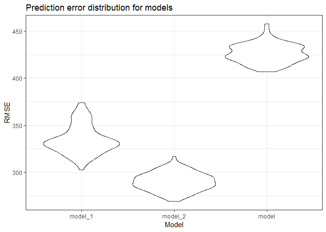

p8105\_hw6\_js5165
================
Jingqi Song
November 28, 2018

Problem 1
---------

### Read and tidy data

``` r
homicide = read_csv('./homicide-data.csv') %>% 
  janitor::clean_names() %>% 
  mutate(city_state = paste(paste0(city, ","), state),
         victim_race = fct_relevel(ifelse(victim_race == 'White', 'white', 'non-white'), 'white'),
         victim_age = as.numeric(victim_age),
         victim_sex = as.factor(victim_sex),
         resolved = as.numeric(disposition == 'Closed by arrest')) %>% 
  filter(!city_state %in% c('Dallas, TX', 'Phoenix, AZ', 'Kansas City, MO', 'Tulsa, AL')) 
```

    ## Parsed with column specification:
    ## cols(
    ##   uid = col_character(),
    ##   reported_date = col_integer(),
    ##   victim_last = col_character(),
    ##   victim_first = col_character(),
    ##   victim_race = col_character(),
    ##   victim_age = col_character(),
    ##   victim_sex = col_character(),
    ##   city = col_character(),
    ##   state = col_character(),
    ##   lat = col_double(),
    ##   lon = col_double(),
    ##   disposition = col_character()
    ## )

    ## Warning in evalq(as.numeric(victim_age), <environment>): NAs introduced by
    ## coercion

### Obtain the estimate and confidence interval for Baltimore

``` r
baltimore_glm = homicide %>% 
  select(uid, victim_race, victim_age, victim_sex, city_state, resolved) %>% 
  filter(city_state == 'Baltimore, MD') %>% 
  glm(resolved ~ victim_age + victim_sex + victim_race, data =., family = binomial()) 

save(baltimore_glm, file = 'Baltimore_logistic.RData')

baltimore_glm %>% broom::tidy() %>% 
  mutate(OR = exp(estimate),
         conf_low = exp(estimate - 1.96*std.error),
         conf_high = exp(estimate + 1.96*std.error)) %>% 
  filter(term == 'victim_racenon-white') %>% 
  dplyr::select(term, estimate, OR, conf_low, conf_high, p.value) %>% 
  knitr::kable(digits = 3)
```

| term                  |  estimate|     OR|  conf\_low|  conf\_high|  p.value|
|:----------------------|---------:|------:|----------:|-----------:|--------:|
| victim\_racenon-white |     -0.82|  0.441|      0.313|        0.62|        0|

### Obtain the estimate and confidence interval for each city

``` r
all_glm = function(x){
  homicide %>% 
  filter(city_state == x) %>% 
  glm(resolved ~ victim_age + victim_sex + victim_race, data =., family = binomial())  %>% 
  broom::tidy() %>% 
  mutate(OR = exp(estimate),
         conf_low = exp(estimate - 1.96*std.error),
         conf_high = exp(estimate + 1.96*std.error)) %>% 
    filter(term == 'victim_racenon-white') %>% 
    dplyr::select(beta = estimate, OR, conf_low, conf_high, p.value)
  }

city_glm = tibble(city_state = unique(homicide$city_state)) %>% 
  mutate(map(.x = unique(homicide$city_state), ~all_glm(.x))) %>% 
  unnest
```

### Plot that shows the estimated ORs and CIs for each city

``` r
city_glm %>%
  mutate(city_state = fct_reorder(city_state, OR)) %>% 
  ggplot(aes(x = city_state, y = OR)) +
  geom_point() +
  geom_errorbar(mapping = aes(ymin = conf_low, ymax = conf_high)) + 
  labs(
    title = 'Estimate OR for Solving Homicides Comparing Non-white Victims to White Victims in Each City',
    x = 'City, State',
    y = 'Estimate OR'
    ) +
  theme(axis.text.x = element_text(angle = 90, size = 7),
        title = element_text(size = 9))
```


All the cities except Durham, Birmingham and Tampa, the estimate ratio are all lower than 1, which indicates the lower odds of solving homicides in non-white victims compared to in white victims. But we also need to consider about the 95% CI when giving our result.

Problem 2
---------

### Read and tidy data

``` r
birthweight = read_csv('./birthweight.csv') %>% 
  janitor::clean_names() %>% 
  mutate(babysex = as.factor(babysex),
         frace = as.factor(frace),
         malform = as.factor(malform),
         mrace = as.factor(mrace))
```

    ## Parsed with column specification:
    ## cols(
    ##   .default = col_integer(),
    ##   gaweeks = col_double(),
    ##   ppbmi = col_double(),
    ##   smoken = col_double()
    ## )

    ## See spec(...) for full column specifications.

``` r
describe(birthweight)
```

    ##          vars    n    mean     sd  median trimmed    mad    min    max
    ## babysex*    1 4342    1.49   0.50    1.00    1.48   0.00   1.00    2.0
    ## bhead       2 4342   33.65   1.62   34.00   33.72   1.48  21.00   41.0
    ## blength     3 4342   49.75   2.72   50.00   49.88   2.97  20.00   63.0
    ## bwt         4 4342 3114.40 512.15 3132.50 3130.76 482.59 595.00 4791.0
    ## delwt       5 4342  145.57  22.21  143.00  143.84  19.27  86.00  334.0
    ## fincome     6 4342   44.11  25.98   35.00   42.02  29.65   0.00   96.0
    ## frace*      7 4342    1.65   0.79    2.00    1.51   1.48   1.00    5.0
    ## gaweeks     8 4342   39.43   3.15   39.90   39.69   2.08  17.70   51.3
    ## malform*    9 4342    1.00   0.06    1.00    1.00   0.00   1.00    2.0
    ## menarche   10 4342   12.51   1.48   12.00   12.47   1.48   0.00   19.0
    ## mheight    11 4342   63.49   2.66   63.00   63.51   2.97  48.00   77.0
    ## momage     12 4342   20.30   3.88   20.00   19.94   2.97  12.00   44.0
    ## mrace*     13 4342    1.63   0.77    2.00    1.51   1.48   1.00    4.0
    ## parity     14 4342    0.00   0.10    0.00    0.00   0.00   0.00    6.0
    ## pnumlbw    15 4342    0.00   0.00    0.00    0.00   0.00   0.00    0.0
    ## pnumsga    16 4342    0.00   0.00    0.00    0.00   0.00   0.00    0.0
    ## ppbmi      17 4342   21.57   3.18   21.03   21.22   2.40  13.07   46.1
    ## ppwt       18 4342  123.49  20.16  120.00  121.65  14.83  70.00  287.0
    ## smoken     19 4342    4.15   7.41    0.00    2.36   0.00   0.00   60.0
    ## wtgain     20 4342   22.08  10.94   22.00   21.73   8.90 -46.00   89.0
    ##            range  skew kurtosis   se
    ## babysex*    1.00  0.05    -2.00 0.01
    ## bhead      20.00 -1.01     4.45 0.02
    ## blength    43.00 -1.17     7.04 0.04
    ## bwt      4196.00 -0.49     1.35 7.77
    ## delwt     248.00  1.20     3.72 0.34
    ## fincome    96.00  0.61    -0.64 0.39
    ## frace*      4.00  1.56     2.74 0.01
    ## gaweeks    33.60 -1.44     5.92 0.05
    ## malform*    1.00 16.92   284.34 0.00
    ## menarche   19.00  0.12     1.58 0.02
    ## mheight    29.00 -0.19     1.12 0.04
    ## momage     32.00  1.30     3.43 0.06
    ## mrace*      3.00  1.49     2.45 0.01
    ## parity      6.00 51.49  2821.55 0.00
    ## pnumlbw     0.00   NaN      NaN 0.00
    ## pnumsga     0.00   NaN      NaN 0.00
    ## ppbmi      33.03  1.59     4.96 0.05
    ## ppwt      217.00  1.49     5.18 0.31
    ## smoken     60.00  2.22     5.38 0.11
    ## wtgain    135.00  0.43     2.74 0.17

There is no missing data in the dataset. I am going to use step-wise selection, which is a data-driven model-building process.

### Selecting predictors for my model

``` r
full_model = lm(bwt ~ ., data = birthweight)
step(full_model, direction='both',trace = 0)
```

    ## 
    ## Call:
    ## lm(formula = bwt ~ babysex + bhead + blength + delwt + fincome + 
    ##     gaweeks + mheight + mrace + parity + ppwt + smoken, data = birthweight)
    ## 
    ## Coefficients:
    ## (Intercept)     babysex2        bhead      blength        delwt  
    ##   -6098.822       28.558      130.777       74.947        4.107  
    ##     fincome      gaweeks      mheight       mrace2       mrace3  
    ##       0.318       11.592        6.594     -138.792      -74.887  
    ##      mrace4       parity         ppwt       smoken  
    ##    -100.678       96.305       -2.676       -4.843

Then we got 11 predictors in our model: babysex, bhead, blength, delwt, fincome, gaweeks, mheight, mrace, parity, ppwt and smoken

Combining previous study result (G. LETAMO: FACTORS INFLUENCING LOW BIRTH WEIGHT AND PREMATURITY; Christopher S.: Maternal characteristics influencing birth weight and infant weight gain in the first 6 weeks post-partum), I chose 6 variables into my model: mother’s weight at delivery, mother’s race, gestational age in weeks, mother’s height, family monthly income, and average number of cigarettes smoked per day during pregnancy.

``` r
model = lm(bwt ~ delwt + fincome + gaweeks + mheight + mrace + smoken, data = birthweight)
summary(model)
```

    ## 
    ## Call:
    ## lm(formula = bwt ~ delwt + fincome + gaweeks + mheight + mrace + 
    ##     smoken, data = birthweight)
    ## 
    ## Residuals:
    ##      Min       1Q   Median       3Q      Max 
    ## -1737.39  -259.92     1.35   275.93  1492.00 
    ## 
    ## Coefficients:
    ##              Estimate Std. Error t value Pr(>|t|)    
    ## (Intercept) -427.3361   180.6501  -2.366 0.018047 *  
    ## delwt          5.2884     0.3230  16.375  < 2e-16 ***
    ## fincome        0.2254     0.2725   0.827 0.408307    
    ## gaweeks       54.4149     2.1024  25.882  < 2e-16 ***
    ## mheight       12.5476     2.7455   4.570 5.01e-06 ***
    ## mrace2      -284.2462    15.2088 -18.690  < 2e-16 ***
    ## mrace3       -47.2740    66.0701  -0.716 0.474331    
    ## mrace4      -110.3942    30.1387  -3.663 0.000252 ***
    ## smoken       -11.6982     0.9035 -12.948  < 2e-16 ***
    ## ---
    ## Signif. codes:  0 '***' 0.001 '**' 0.01 '*' 0.05 '.' 0.1 ' ' 1
    ## 
    ## Residual standard error: 425.5 on 4333 degrees of freedom
    ## Multiple R-squared:  0.3109, Adjusted R-squared:  0.3096 
    ## F-statistic: 244.3 on 8 and 4333 DF,  p-value: < 2.2e-16

``` r
#check assumption
par(mfrow = c(2,2))
plot(model)
```


We can see that the normal Q-Q plot is linear, the assumption is not violated.

``` r
res_fit = birthweight %>% 
  add_predictions(model) %>% 
  add_residuals(model)
ggplot(res_fit, aes(x = pred, y = resid)) +
    geom_point() +
    labs(
      title = 'Residual vs. Fit',
      x = 'Prediction',
      y = 'Residual'
      )
```


We can see the residuls are clustered. The model still need to be refined.

### Model Comparison

``` r
cv = birthweight %>% 
  crossv_mc(100)
cv_compare = cv %>% 
  mutate(model_1 = map(train, ~lm(bwt ~ blength + gaweeks, data = .)),
         model_2 = map(train, ~lm(bwt ~ bhead + blength + babysex + bhead*babysex + bhead*blength + blength*babysex + bhead*babysex*blength, data = .)),
         model = map(train, ~lm(bwt ~ delwt + fincome + gaweeks + mheight + mrace + smoken, data = .)),
         rmse_model_1 = map2_dbl(model_1, test, ~rmse(.x, .y)),
         rmse_model_2 = map2_dbl(model_2, test, ~rmse(.x, .y)),
         rmse_model = map2_dbl(model, test, ~rmse(.x, .y)))
```

Comparison Using Plot
---------------------

``` r
cv_compare %>% 
  select(starts_with('rmse')) %>% 
  gather(key = model, value = rmse, rmse_model_1:rmse_model) %>% 
  mutate(model = str_replace(model, 'rmse_', ""),
         model = fct_inorder(model)) %>% 
  ggplot(aes(x = model, y = rmse)) + 
  geom_violin() + 
  labs(
    title = "Prediction error distribution for models",
    x = "Model",
    y = "RMSE"
   )
```



Based on the violin plot, my model has the smallest RMSE.
